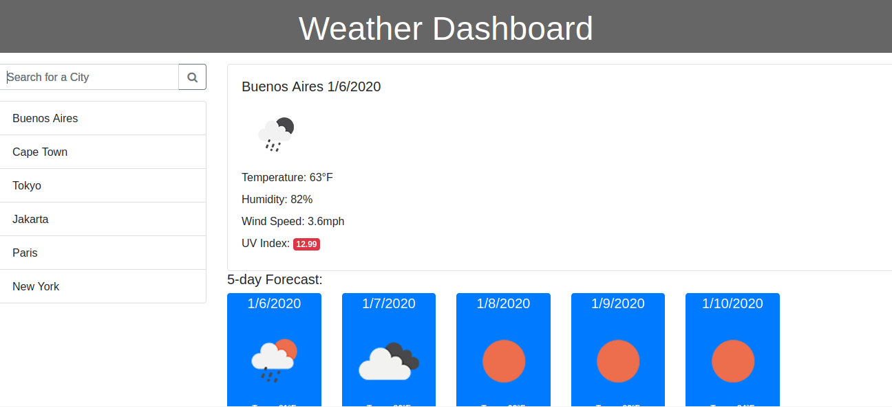

# weather-dashboard

The weather dashboard enables the user to see the current weather for any city in the world, and the weather in that city over the next 5 days. 

This application is powered by the openweathermap.org API.

## using the weather dashboard

Search for a city using the input on the left. Upon submitting the query, the page will populate with data from openweathermap.org. The application saves recently searched cities, and clicking on them will repeat the search for the corresponding city. The searches are saved to the browser's local storage, and upon page load, it will automatically populate with the most recent search.

## installing the weather dashboard

Download the folder and run "index.html" in your browser.

## screenshot

